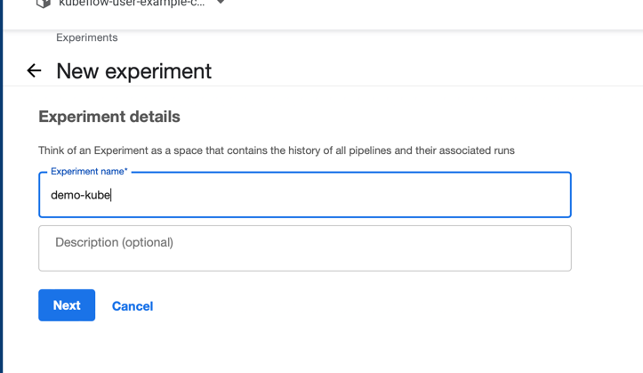

# MLOps-Kubeflow-Sagemaker

# Kubeflow Pipelines with Amazon SageMaker


### Prerequisites 

1. IAM role and Policies
2. An EC2 Instance with Kubeflow installed

### Permissions

Note: The permissions here are a open to allow for a quick workshop experience, these can be further locked down in development and production based on the persona. Data scientist, MLops..etc. 

- CloudWatchLogsFullAccess 
- [AWSCloudFormationFullAccess](https://console.aws.amazon.com/iam/home?region=us-east-1#/policies/arn%3Aaws%3Aiam%3A%3Aaws%3Apolicy%2FAWSCloudFormationFullAccess)
- IAMFullAccess 
- AmazonS3FullAccess 
- AmazonEC2FullAccess 
- AmazonEKSAdminPolicy (Create this policy using the schema from [Amazon EKS Identity-Based Policy Examples](https://docs.aws.amazon.com/eks/latest/userguide/security_iam_id-based-policy-examples.html)), See below for what we need.

1. Start with an IAM role with sufficient permissions which we will use to attach to an EC2 instance.

   Goto IAM Console, Select Roles, Create Role

   

    

   

   In the search bar, type each of the below managed policy names and select the check box

   

   Once all these are selected, click next, Give your role a name "kubeflow-gateway-role" and click create.

   

   Create two inline policies,one for KMS and another for EKS following the steps below. 

   

   go back to IAM console, select policies in left navigation and create policy 

   

   

   Select the JSON tab and replace the contents with 

EKS Admin Policy

```json
{
    "Version": "2012-10-17",
    "Statement": [
        {
            "Effect": "Allow",
            "Action": [
                "eks:*"
            ],
            "Resource": "*"
        },
        {
            "Effect": "Allow",
            "Action": "iam:PassRole",
            "Resource": "*",
            "Condition": {
                "StringEquals": {
                    "iam:PassedToService": "eks.amazonaws.com"
                }
            }
        }
    ]
}
```

Click "Next:Tags", then click "Next:Review". Name the policy "kubeflow-gateway-eks" and click the "Create policy" button.

Repeat these "create policy" steps to create another new poilicy with the name "kubeflow-kms-admin"

KMS Policy

```json
{
    "Version": "2012-10-17",
    "Statement": [
        {
            "Sid": "VisualEditor0",
            "Effect": "Allow",
            "Action": "kms:*",
            "Resource": "*"
        }
    ]
}
```

After creating these two new Policies, attach these Policies to the IAM role created above: kubeflow-gateway-role


### Create EC2 instance as a Kubernetes Gateway

This instance is our gatway instance to interact with Kubeflow via cli, UI, code and notebooks.

From Console, Type EC2 in search and click on EC2 service, This will take you to EC2 console.

Click on the "Launch Instance" button, then provide a name for the instance: "kubeflow-gateway"


Be sure and select the AMI named "Ubuntu 20.04 LTS (HVM)"


Click create new key pair, and select PEM file, name the key pair "eventengine-test-kubeflow". The PEM file will download to your local drive. 


Click the triangle icon next to "Advanced details" to expand this section. Now attach the IAM role you created above "kubeflow-gateway-role" to the instance under the dropdown "IAM instance profile". An alternative way to do this is to configure using Access key and Secret Access key inside the instance, but this is not very secure and is discouraged.


**Click Launch Instance**

### Installing Kubeflow for AWS

Next ssh into the EC2 instance using the key pair you created and follow the steps below to install Kubeflow for AWS, spin up a Kubernetes Cluster.

### SSH into the instance 

Change permission on the key pair file that was downloaded to your local machine.

`chmod 400 ~/Downloads/eventengine-test-kubeflow.pem`

Get the "instance-ip", the public ip or public DNS for your new EC2 instance from the EC2 page on the AWS console, then run the ssh command as shown below:

ssh -i <path-to-pem> ubuntu@instance-ip

Set up your environment for deploying Kubeflow on AWS by running each of the commands shown below:

```bash
#Clone the awslabs/kubeflow-manifests and the kubeflow/manifests repositories and check out the release branches of your choosing
export KUBEFLOW_RELEASE_VERSION=v1.6.1
export AWS_RELEASE_VERSION=v1.6.1-aws-b1.0.0
git clone https://github.com/awslabs/kubeflow-manifests.git && cd kubeflow-manifests
git checkout ${AWS_RELEASE_VERSION}
git clone --branch ${KUBEFLOW_RELEASE_VERSION} https://github.com/kubeflow/manifests.git upstream

export MANIFEST_DIR=$PWD
```

Install necessary libraries/tools - <based on testing>

```bash
sudo apt update
sudo apt install make
sudo apt install unzip
sudo apt install -y jq
sudo apt install python3-pip -y
pip install testresources
```

Edit the Makefile to remove instructions to install jq

1. vi Makefile

2. Delete install-jq section 

3. In the "install-tools" line, delete "install-jq" 

Install the necessary tools with the following command: 

```bash
make install-tools 
source ~/.bash_profile # not needed , there may not be one
```

Deploy the vanilla version of Kubeflow on AWS and related AWS resources like EKS using Terraform. The 'make deploy' command will take about 15 minutes to complete.

Please note that EBS volumes used in EKS nodegroup are not encrypted by default:

```bash
#Define the following environment variables

#Region to create the cluster in
export CLUSTER_REGION=us-west-2
#Name of the cluster to create
export CLUSTER_NAME=kubeflow-demo
```

```bash
cd deployments/vanilla/terraform

#Save the variables to a .tfvars file
cat <<EOF > sample.auto.tfvars
cluster_name="${CLUSTER_NAME}"
cluster_region="${CLUSTER_REGION}"
EOF

#Run the following one-click command to deploy terraform to install EKS infrastructure and Kubeflow
make deploy
```

## Set up the Kubeflow Permissions

Add permissions to Notebook pod and Pipeline component pod to make SageMaker, S3 and IAM api calls using `kubeflow_iam_permissions.sh` script.

```bash
export NAMESPACE=kubeflow-user-example-com

wget https://raw.githubusercontent.com/aws-samples/eks-kubeflow-cloudformation-quick-start/9e46662d97e1be7edb0be7fc31166e545655636a/utils/kubeflow_iam_permissions.sh
chmod +x kubeflow_iam_permissions.sh
./kubeflow_iam_permissions.sh $NAMESPACE $CLUSTER_NAME $CLUSTER_REGION
```

Create SageMaker execution role to enable SageMaker training job to access training dataset from S3 service using `sagemaker_role.sh` script.

```bash
wget https://raw.githubusercontent.com/aws-samples/eks-kubeflow-cloudformation-quick-start/9e46662d97e1be7edb0be7fc31166e545655636a/utils/sagemaker_role.sh
chmod +x sagemaker_role.sh
./sagemaker_role.sh
```

## Access the Kubeflow dashboard

To access the Kubeflow dashboard, complete the following steps:

Note that it is possible to run the Kubeflow dashboard locally in the Cloud9 environment without exposing your URLs to public internet.

```html
# Configure Kubecontext, Make sure you are still in
# terraform directory as you run this.
$(terraform output -raw configure_kubectl)

cd ${MANIFEST_DIR}
make port-forward
```
The 'make port-forward' command will loop indefinitely. Now open another terminal window on your local machine and run the following command:

```bash
ssh -i ~/Downloads/eventengine-test-kubeflow.pem -L 9005:localhost:8080 -N ubuntu@<Public IPv4 DNS> -o ExitOnForwardFailure=yes
```
Now that the port forwarding is established, in your browser, go to the following URL:

#### localhost:9005

And login to the Kubeflow dashboard with these credentials:

Username: user@example.com

Password: 12341234


You can create a new notebook instance, try and run some of the pre-built examples here

----------------------More Examples----------------------------------

### Check pipeline compiler kfp and dsl-compile

Next kill the SSH tunnel and port forward with Ctrl C. 

We will clone a repo with a sample training script and try and compile and deploy it to run on Amazon SageMaker.

On your gateway instance (EC2 we created), SSH into the instance and check 

```
which dsl-compile
```

if you get a path great, if not 

```bash
sudo pip3 install kfp
```

try which dsl-compile again. it should show "/usr/local/bin/dsl-compile" as output

### Compile a pipeline to upload to kubeflow dashboard

Next clone the samples repo and follow instructions to compile the pipeline

```bash
git clone https://github.com/kubeflow/pipelines.git
cd pipelines/samples/contrib/aws-samples/mnist-kmeans-sagemaker
```

Create a role for Sagemaker execution before your run compile 

```bash
SAGEMAKER_EXECUTION_ROLE_NAME=kfp-example-sagemaker-execution-role

TRUST="{ \"Version\": \"2012-10-17\", \"Statement\": [ { \"Effect\": \"Allow\", \"Principal\": { \"Service\": \"sagemaker.amazonaws.com\" }, \"Action\": \"sts:AssumeRole\" } ] }"
aws iam create-role --role-name ${SAGEMAKER_EXECUTION_ROLE_NAME} --assume-role-policy-document "$TRUST"
aws iam attach-role-policy --role-name ${SAGEMAKER_EXECUTION_ROLE_NAME} --policy-arn arn:aws:iam::aws:policy/AmazonSageMakerFullAccess
aws iam attach-role-policy --role-name ${SAGEMAKER_EXECUTION_ROLE_NAME} --policy-arn arn:aws:iam::aws:policy/AmazonS3FullAccess

aws iam get-role --role-name ${SAGEMAKER_EXECUTION_ROLE_NAME} --output text --query 'Role.Arn'
```

Create a bucket 

```bash
export S3_BUCKET_NAME=dl-demo-kubeflow-<initials-randomnums>
export SAGEMAKER_REGION=us-west-2
aws s3api create-bucket --bucket ${S3_BUCKET_NAME} --region ${SAGEMAKER_REGION} --create-bucket-configuration LocationConstraint=us-west-2
```

Next copy the preprocessing file file into the bucket, from the folder

~/pipelines/samples/contrib/aws-samples/mnist-kmeans-sagemaker

```bash
aws s3 cp kmeans_preprocessing.py s3://${S3_BUCKET_NAME}/mnist_kmeans_example/processing_code/kmeans_preprocessing.py
```

Go to S3 bucket, create a folder called mnist-input and upload the mnist.pkl.gz file from instructor.


### Pipeline

You can compile the pipeline file *mnist-classification-pipeline.py* on your own or use the tar file that is provided. If you compile the pipeline file on your EC2 instance, you then need to download the pipeline file to your local machine using the following command: 

```bash
scp -i <path to pem> ubuntu@<ec2-ip>:<path to tar file>  .
```

OR 

You can use the tar file provided by the instructor.

Once the file is on your local machine, you can then upload this file using the Kubeflow UI. If the ssh tunnel is no longer connected, you will need to restart the port forwarding to get to the Kubeflow UI. To reconnect the ssh tunnel, run the 'make port-forward' and ssh tunnel commands as shown previously.

To run a pipeline in Kubeflow, you will first need an experiment , create experiment from left side list menu and create an experiment and give it a name 




Next upload the pipeline tar file provided in the chat channel - choose the file as shown below and select the file you grabbed from the chat.


Successful upload show the pipeline in list of pipelines


Go to Runs, Create Run and select the pipeline we just uploaded. choose the experiment we just created and provide the bucket name and role arn variables.

Role Arn can be copied from your terminal from the earlier step when you created it as shown below 


or from AWS IAM Console


Start a run 


And now click the Start button.
    
    
### Additional Example to run 
Once you’re logged in to the Kubeflow dashboard, ensure you have the right namespace (kubeflow-user-example-com) chosen. Complete the following steps to set up your Kubeflow on AWS environment:

    On the Kubeflow dashboard, choose Notebooks in the navigation pane.
    Choose New Notebook.
    For Name, enter aws-nb.
    For Jupyter Docket Image, choose the image jupyter-pytorch:1.12.0-cpu-py38-ubuntu20.04-ec2-2022-09-20 (the latest available  jupyter-pytorch DLC image).
    For CPU, enter 1.
    For Memory, enter 5.
    For GPUs, leave as None.
    Don’t make any changes to the Workspace and Data Volumes sections.

    Select Allow access to Kubeflow Pipelines in the Configurations section and Choose Launch.

    Verify that your notebook is created successfully (it may take a couple of minutes).

    Choose Connect to log in to JupyterLab.
Clone the repo by entering https://github.com/aws-samples/eks-kubeflow-cloudformation-quick-start.git in the Clone a repo field.
Choose Clone.
    
#### Run a distributed training example

- After you set up the Jupyter notebook, you can run the entire demo using the following high-level steps from the folder eks-kubeflow-cloudformation-quick-start/workshop/pytorch-distributed-training in the cloned repository:

- Run the PyTorch Distributed Data Parallel (DDP) training script – Refer to the PyTorch DDP training script cifar10-distributed-gpu-final.py, which includes a sample convolutional neural network and logic to distribute training on a multi-node CPU and GPU cluster.
- Create a Kubeflow pipeline – Run the notebook STEP1.0_create_pipeline_k8s_sagemaker.ipynb to create a pipeline that runs and deploy models on SageMaker. Make sure you install the SageMaker library as part of the first notebook cell and restart the kernel before you run the rest of the notebook cells.
- Invoke a SageMaker endpoint – Run the notebook STEP1.1_invoke_sagemaker_endpoint.ipynb to invoke and test the SageMaker model inference endpoint created in the previous notebook.

    
**Reference:** https://aws.amazon.com/blogs/machine-learning/enabling-hybrid-ml-workflows-on-amazon-eks-and-amazon-sagemaker-with-one-click-kubeflow-on-aws-deployment/

